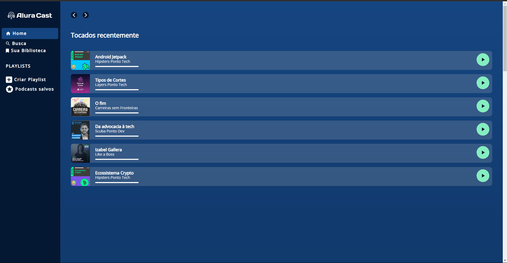

# Treinamento de Grid com HTML e CSS

Este repositório contém um projeto focado no **treinamento de disposição de elementos em páginas web** utilizando **CSS Grid**. O objetivo principal foi aplicar os conhecimentos adquiridos no curso da [Alura](https://www.alura.com.br/) sobre Grid Layout.

## Tecnologias Utilizadas

- **HTML5**
- **CSS3**

## Objetivo do Projeto

- Praticar e consolidar os conceitos de **CSS Grid**.
- Desenvolver layouts responsivos e bem organizados.
- Aperfeiçoar habilidades de design e estruturação de páginas web.

---

## Pré-visualização

  

---

📚 *Projeto desenvolvido como parte do aprendizado no curso da Alura.*
